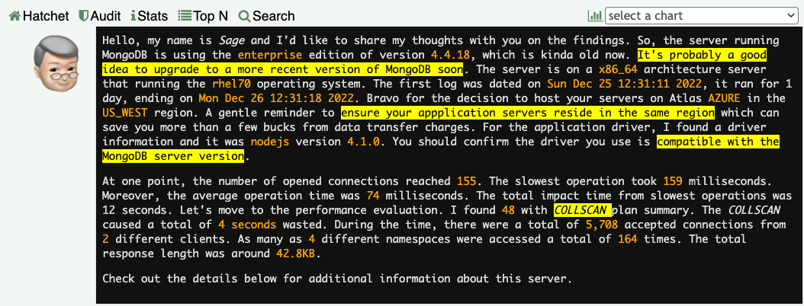

# Hatchet - MongoDB JSON Log Analyzer and Viewer
Hatchet is a powerful and sophisticated logs analyzer and viewer specifically designed for MongoDB JSON logs. It provides advanced features for logs processing, aggregation and storage of the processed data. To make the data accessible and usable for its users, Hatchet utilizes an embedded SQLite3 database. This database allows for the storage of processed and aggregated data and makes it possible to offer RESTful APIs and a web interface to users.

The web interface of Hatchet is highly interactive and user-friendly, providing a seamless experience for searching logs and navigating through reports and charts. The intuitive design and easy-to-use interface makes it simple for users to find what they need, when they need it. Additionally, with the embedded database, Hatchet provides fast access to data and a high level of performance, making it the ideal solution for logs analysis and management. Further design details can be found at [Streamline Your MongoDB Log Analysis with Hatchet](https://www.simagix.com/2023/02/streamline-your-mongodb-log-analysis.html).

## Build
Clone and run the *build.sh* script; *gcc* is required to support CGO.
```bash
git clone --depth 1 git@github.com:simagix/hatchet.git
cd hatchet ; ./build.sh
```

An executable *hatchet* is output to the directory *dist/*.

## Quick Start
Use the command below to process a log file, mongod.log.gz and start a web server listening to port 3721.
```bash
./dist/hatchet -web mongod.log.gz
```

Use the URL `http://localhost:3721/` in a browser to view reports and charts.  Alternatively, you can use the in-memory mode without persisting data, for example:
```bash
./dist/hatchet -in-memory mongod.log.gz
```

if you choose to view in the legacy format without a browser, use the command below:
```bash
./dist/hatchet -legacy mongod.log.gz
```

For additional usages and integration details, see [developer's guide](README_DEV.md).

## A Smart Log Analyzer
How smart Hatchet is?  A picture is worth a thousand words.



## License
[Apache-2.0 License](LICENSE)
